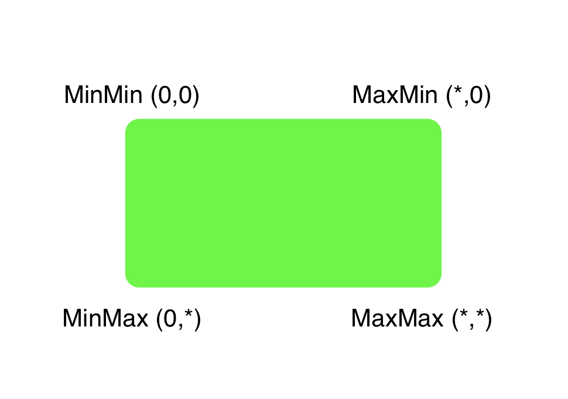

## iOS 11 SDK new API to make rounded corners for view

Finally, Apple added new api for making rounded corners for views in iOS 11 SDK. Let's take a look at it.

It's all done via just one property on CALayer

```swift
var maskedCorners: CACornerMask { get set }
```

where `CACornerMask` is OptionSet

```swift
struct CACornerMask : OptionSet {
    
    public static var layerMinXMinYCorner: CACornerMask { get }
    public static var layerMaxXMinYCorner: CACornerMask { get }
    public static var layerMinXMaxYCorner: CACornerMask { get }
    public static var layerMaxXMaxYCorner: CACornerMask { get }
}
```

All we know that iOS coordinate system (UIKit) starts from top left corner


here **CACornerMask** has the same idea, where `layerMinXMinYCorner` is top left corner and `layerMaxXMaxYCorner` bottom right corner as it's shown on image below



### How to

It's easy to:

- set corner radius value
- set what corners you want to be rounded

```swift
roundedView.layer.cornerRadius = 12
roundedView.layer.maskedCorners = [
    .layerMaxXMaxYCorner,
    .layerMaxXMinYCorner,
    .layerMinXMaxYCorner,
    .layerMinXMinYCorner
]
```

