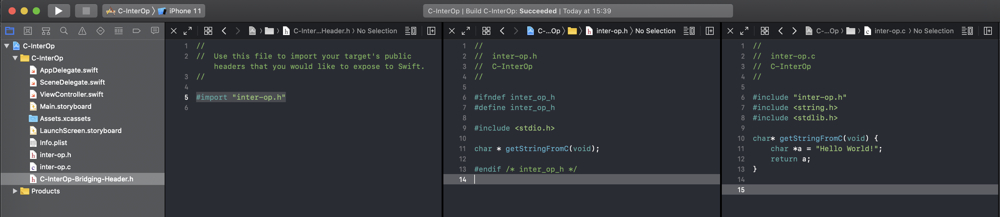

C and Swift basics.

As you may know it is possible to work with c source code from Swift almost out of box. To make it work you only need to add to iOS project bridging header file where you put the imports of c header files that you want to work with. Xcode will scan this file and generate modeulemap file(s) from imported headers that Swift can work with. `modeulemap` itself is binary file and you cannot see what is there from any text editor, but if you want this you can use `swift-ide-test` tool from Swift toolchanin, here is some info about https://forums.swift.org/t/whats-in-the-file-of-swiftmodule-how-to-open-it/1032.

Okay, let's see how we can call simpliest c function from Swift. For this we create `inter-op.h` and `inter-op.c` files in our Xcode application target. In header file declare function:

```c
char * getStringFromC(void);
```

and its implementation in c source file:

```c
char* getStringFromC(void) {
    char *a = "Hello World!";
    return a;
}
```

Then we import c header file in projtect's bridging header file as:

```c
#import "inter-op.h"
```

Here is screenshot how it looks like.



Now build the project and call this function from Swift. As this function defined via bridging header then it is available from any place in Swift and there no need to import it explicitly. In Swift we get this:

```swift
let string: UnsafeMutablePointer<Int8>! = getStringFromC()
```

As you can see this function should have been return `String` type, but we got some strange unusual type `UnsafeMutablePointer<Int8>`. What is that ? To find out we have to look at c function a bit closer.

```c
char * getStringFromC(void);
```

In c there no such type as String, but it is just an array of characters that defined as `char *` or `char []`. Moreover, a variable of this type

```c
char *a = "Hello World!";
```

doesn't hold whole string, but only pointer to a first character of string. To get second character you need to move the pointer to the next character:

```c
char *a = "Hello World!";
// Use *a to get value of the pointer, this process is called dereference.
printf("%c", *a); // prints 'H'
printf("%c", a[0]); // prints 'H'

// Move pointer to the next character.

a++;
printf("%c", *a); // prints 'e'
printf("%c", a[1]); // prints 'e'
```

That is why in Swift we see `UnsafeMutablePointer` instead of `String` one. So how we get Swift's String type from `UnsafeMutablePointer` ? That is almost easy because Swift's String has a special initializer:

```swift
public init(cString: UnsafePointer<CChar>) // where public typealias CChar = Int8
```

First of we need to convert/cast `UnsafeMutablePointer` to `UnsafePointer`, do this via special `OpaquePointer` type that erasures concrete type of `UnsafeMutablePointer`.

```swift
let opaquePointer: OpaquePointer = OpaquePointer(string)
```

then create `UnsafePointer` from this opaque pointer type.

```swift
let pointer = UnsafePointer<Int8>(opaquePointer)!
```

and now we are ready to initialize Swift's String.

```swift
let string: UnsafeMutablePointer<Int8>! = getStringFromC()
let opaquePointer: OpaquePointer = OpaquePointer(string)
let pointer: UnsafePointer<Int8> = UnsafePointer<Int8>(opaquePointer)!        
let swiftString = String(cString: pointer)
```

After this you may ask why do we need convert `UnsafeMutablePointer` to `UnsafePointer` or why they are different. To be honest these types not so different, `mutable` in `UnsafeMutablePointer` states that it is mutable and you can make thange to it, for example change a character in c string. `UnsafePointer` behaves like immutable values in Swift, you cannot make changes to it. You even can make this thing in c code for what Xcode will generate `UnsafePointer` type for return value.

```c
const char * getImmutableStringFromC(void) {
    const char *a = "Hello World!";
    return a;
}
```

```swift
let string: UnsafePointer<Int8>! = getImmutableStringFromC()
let str = String(cString: string)
```

### Memory management.

As you've seen from examle above we used in c function constant string:

```c
char *a = "Hello World!";
```

that is this string located in static memory (put there by compiler) and never released. But when a string is allocated in heap (dynamic application memory) then we are responsible for releasing it after we ended using it.

```c
const char * getHeapAllocatedStringFromC(void) {
    char* s = malloc(sizeof(char) * 6);
    strcpy(s, "Hello");
    return s;
}
```

Here we allocate memory for 5 characters + 1 string terminator character ('\0', in c all strings must be null terminated).

```swift
let string: UnsafePointer<Int8>! = getHeapAllocatedStringFromC()
let str = String(cString: string)

print(str)

string.deallocate() // free memory
```

or we can use built-in c function to free a memory

```swift
free(UnsafeMutableRawPointer(OpaquePointer(string)))
```

### Get a string from c by passing string pointer from Swift.

If you are familia with c standard library you've seen that a lot of functions being working with strings take a pointer to a string and fill that pointer with characters:

```c
char* s = malloc(sizeof(char) * 6);
strcpy(s, "Hello"); // copies "Hello" to s.
```

In c library declaration of this function following:

```c
char *strcpy(char *dest, const char *src)
```

where `dest` is a pointer to memory to where copy string from `src`. Here we allocated memory for 6 characters and in `dest` will be written following string "Hello\0". Now let's create a c function where we get pointer to string and fill it with some string.

```c
void cConvertIntToString(int input, char* dest) {
    sprintf(dest, "%i", input);
}
```

We pass to this function some int value, convert it to a string and write a result to string buffer.

```swift
// create a pointer to a memory of 20 bytes.
let buf = UnsafeMutableBufferPointer<Int8>.allocate(capacity: 20)

// call the c function and pass there Int and a pointer to contiguous 20 bytes memory block.
cConvertIntToString(999, buf.baseAddress!)

// create Swift's String from string pointer.
let str = String(cString: UnsafePointer<Int8>(OpaquePointer(buf.baseAddress!)))
print(str) // prints "999"

buf.deallocate() // free allocated buffer.
```

### Simple example how to pass a string from Swift to c.

Assume we have c function like this:

```c
void useStringForSomething(const char* string) {
    puts(string); // just print a string to stdout.
}
```

It is just simple as:

```swift
let string = "abcd"
string.withCString { (p: UnsafePointer<Int8>) -> Void in
    useStringForSomething(p)
}
```

### C structs from Swift.

Let's define c struct:

```c
typedef struct user_t {
    char *name;
} user;
```

and function that fills its property:

```c
void getCurrentUser(user *u) {
    u->name = "Jay Z";
}
```
And how to use this from Swift:

```swift
var u: user = user()
withUnsafeMutablePointer(to: &u) { (p: UnsafeMutablePointer<user>) -> Void in
    getCurrentUser(p)
}

let name = String(cString: UnsafePointer<Int8>(OpaquePointer(u.name)))
print(name) // prints "Jay Z"
```

### Final thoughts.

We've seen that using c API from Swift not so hard how it sounds. All Swift wrappers around pointers to a memory have names Unsafe[Mutable][Raw][Buffer]Pointer. Also as c doesn't have ARC and you allocate a memory then you must release it after using.
